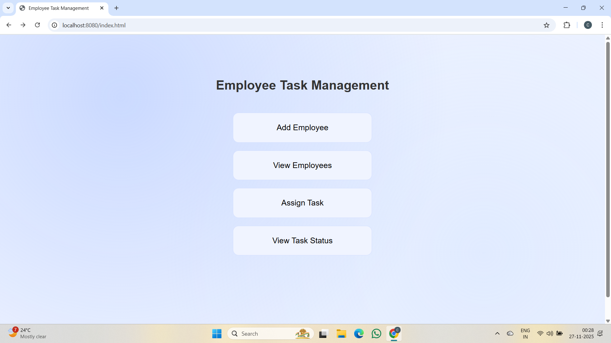
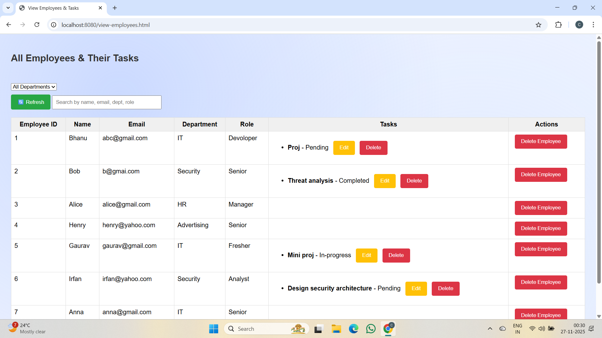
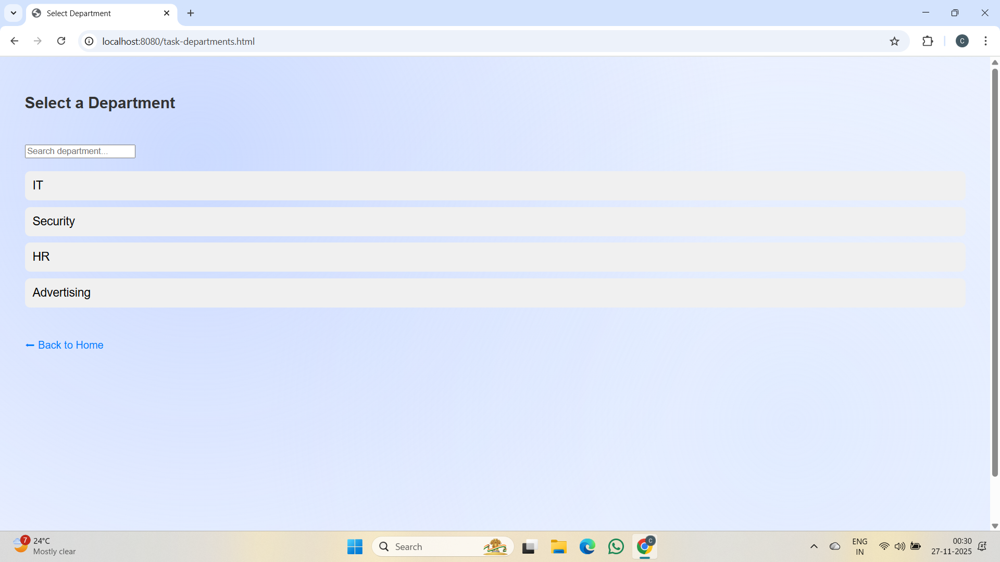
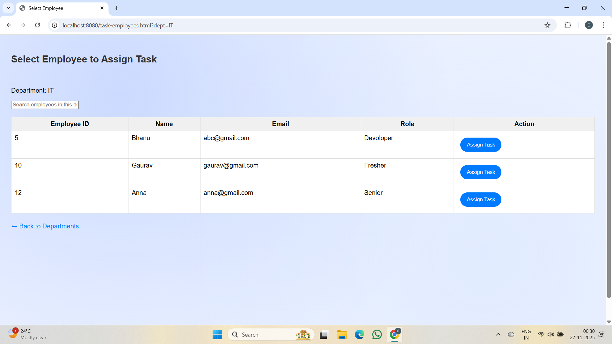
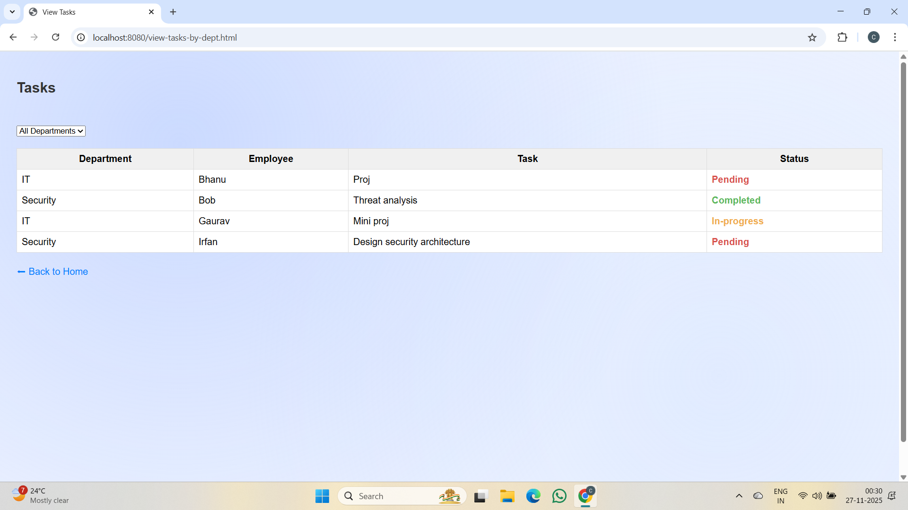

## 📌 Employee Task Management System

A simple and efficient web-based application to manage employees, assign tasks, and track task progress.  
Built using **Spring Boot, MySQL, HTML, CSS, and JavaScript**.

---

## 🚀 Features

✔️ Add, view, and delete employees  
✔️ Assign tasks to employees  
✔️ Edit and delete assigned tasks  
✔️ Search employees by name, email, department, or role  
✔️ Filter employees by department  
✔️ View tasks and their status sorted by department 
✔️ Clean and user-friendly UI  

---

## 🛠️ Tech Stack Used

| Layer | Technology |
|------|------------|
| Backend | Java, Spring Boot, Spring Web, Spring Data JPA |
| Database | MySQL |
| Frontend | HTML, CSS, JavaScript |
| ORM | Hibernate |
| Server | Embedded Tomcat |
| API Style | RESTful APIs |
| Build Tool | Maven |

---

## 📂 Project Structure

```text
/src
 └── main
      ├── java
      │    └── com
      │         └── employeetaskmanagement
      │               ├── controller
      │               │     ├── EmployeeController.java
      │               │     └── TaskController.java
      │               ├── model
      │               │     ├── Employee.java
      │               │     └── Task.java
      │               ├── repository
      │               │     ├── EmployeeRepository.java
      │               │     └── TaskRepository.java
      │               ├── service
      │               │     ├── EmployeeService.java
      │               │     └── TaskService.java
      │               └── EmployeeTaskManagementApplication.java
      └── resources
           ├── static
           │     ├── index.html
           │     ├── add-employee.html
           │     ├── view-employees.html
           │     ├── task-departments.html
           │     ├── task-employees.html
           │     ├── assign-task.html
           │     ├── view-tasks.html
           │     ├── script.js
           │     └── style.css
           ├── templates
           └── application.properties

```
---

## 🧰 Setup Instructions

### 1️⃣ Clone the Repository

```bash
git clone https://github.com/bhanuchandanisetti-lgtm/Employee-Task-Management.git
cd Employee-Task-Management
```
* * *

### 2️⃣ Configure MySQL Database

Create a database:
```bash
CREATE DATABASE employe_task_management;
```
Update `src/main/resources/application.properties` with your MySQL credentials:
```bash
spring.application.name=employe_task_management
spring.datasource.url=jdbc:mysql://localhost:3306/employe_task_management
spring.datasource.username=YOUR_USERNAME
spring.datasource.password=YOUR_PASSWORD
spring.jpa.hibernate.ddl-auto=update
spring.jpa.show-sql=true
spring.jpa.properties.hibernate.dialect=org.hibernate.dialect.MySQLDialect
```
* * *

### 3️⃣ Running the Project in IntelliJ IDEA

1. Open IntelliJ → **File > Open** → Select this project folder
2. Wait for Maven dependencies to download automatically
3. Open `EmployeeTaskManagementApplication.java`
4. Right-click → **Run**
5. Access the frontend via `src/main/resources/static/index.html`


Backend starts at:
```text
http://localhost:8080/
```
* * *

### 4️⃣ Access the Frontend

Open the main page:

`src/main/resources/static/index.html`

Right-click → **Open in browser**  

### 🔹 Home Page
Users can choose any of the primary actions:
- Add Employee  
- View Employees & Tasks  
- Assign Task  
- View Task Status



From there, navigate through:
### 🔹 Add Employee
From the **Home Page**, click **"Add Employee"**:

- Enter **Name**, **Email**, **Department**, and **Role**
- Click **"Add Employee"** to save
- The new employee will appear in:
  - **View Employees & Tasks**
  - **Assign Task**  (under their department)


### 🔹 View Employees
Displays all employees, their details, and assigned tasks.  
Supports:
- Sorting/filtering by department  
- Searching by name, email, role, or department  
- Editing/deleting tasks  
- Deleting employees   



### 🔹 Assign Task
1️⃣ **Click "Assign Task"** on the Home Page 

2️⃣ **Select a Department** from the department list 



3️⃣ **Choose an Employee** within that department



4️⃣ **Fill task details** (Title, Description, Status) 


5️⃣ **Assign the task** to store it in the system
    
### 🔹 View Task Status
Shows tasks grouped by departments with color-coded statuses:
- 🟥 Pending  
- 🟨 In-progress  
- 🟩 Completed



| Page               | Purpose                                                        |
| ------------------ | -------------------------------------------------------------- |
| **Add Employee**   | Register a new employee with basic details                     |
| **Assign Task**    | Select a department → choose an employee → assign a task       |
| **View Employees** | View all employees, their tasks, and manage them (edit/delete) |
| **View Tasks**     | View tasks and their status grouped by department              |

---

## 📝 Conclusion

This project successfully demonstrates the integration of a Spring Boot backend with a clean JavaScript-based frontend to manage employees and tasks efficiently. It delivers essential features such as employee registration, task assignment, and status tracking, making it suitable for organizational task management workflows. Future enhancements can include authentication, user roles, and analytics dashboards.


